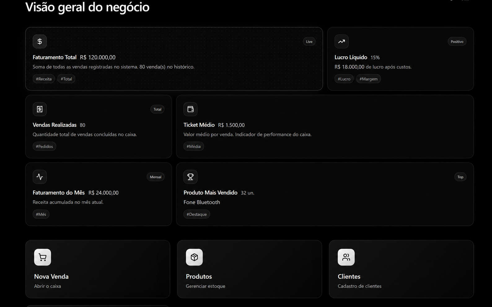
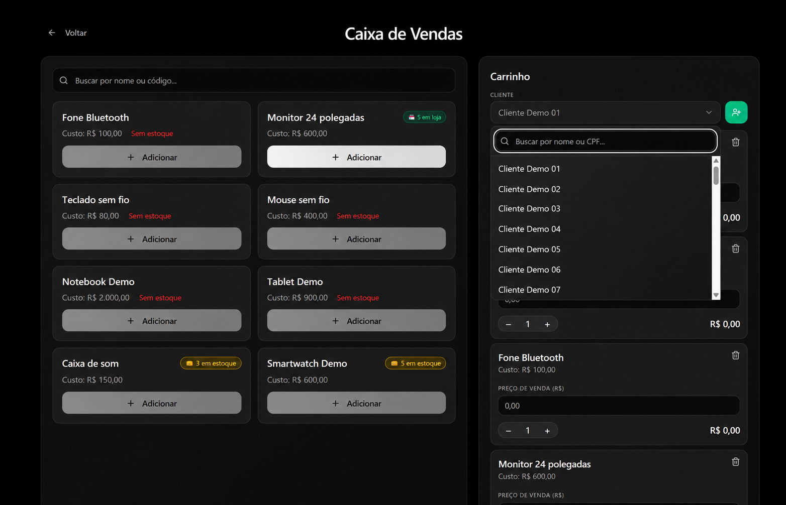
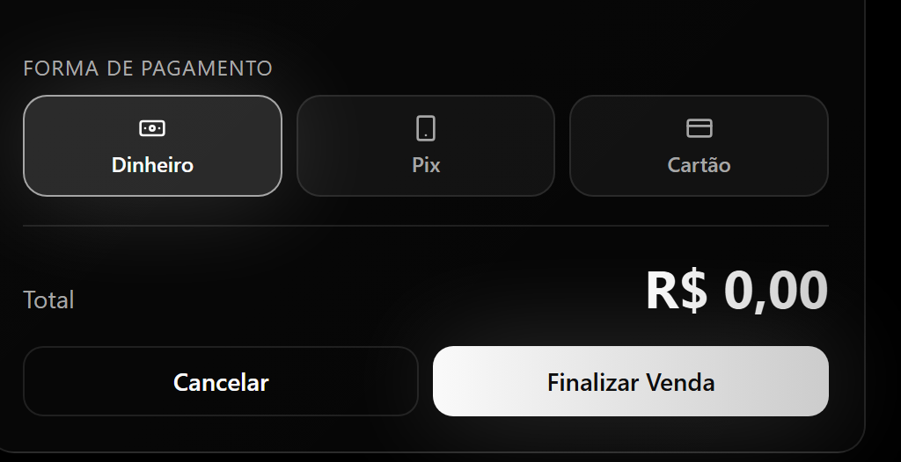
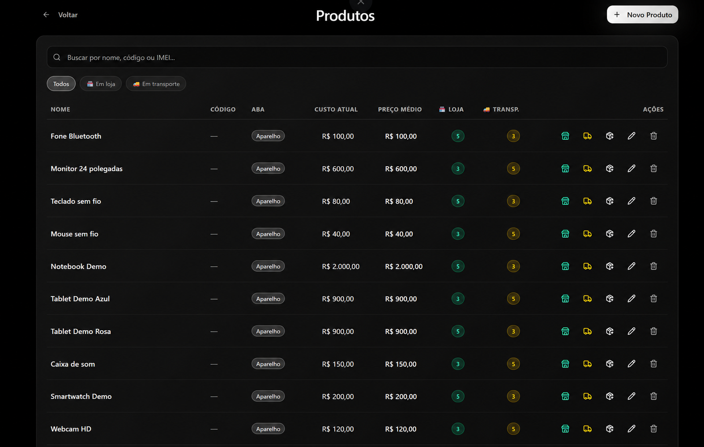
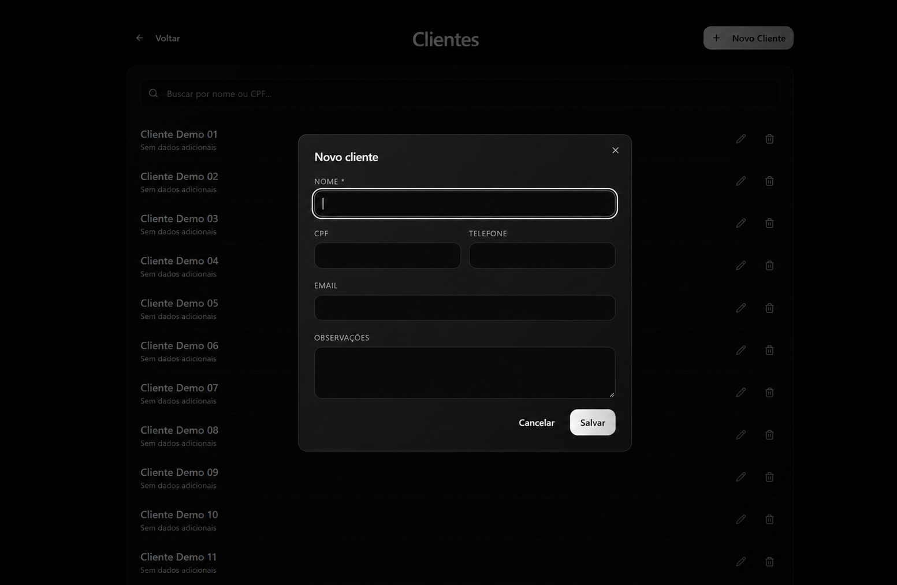
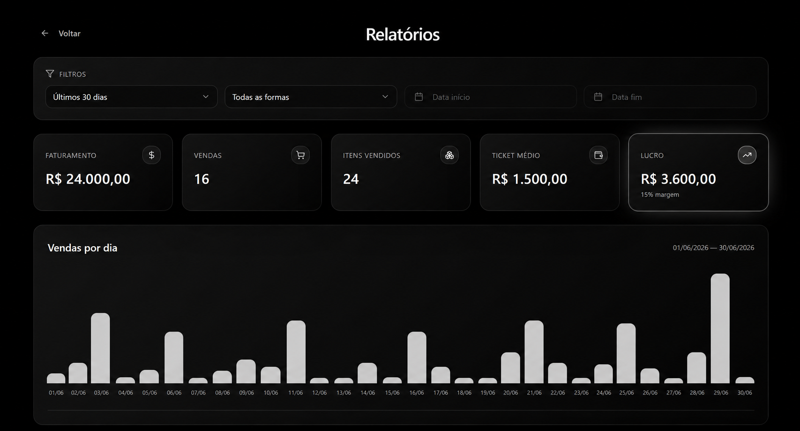
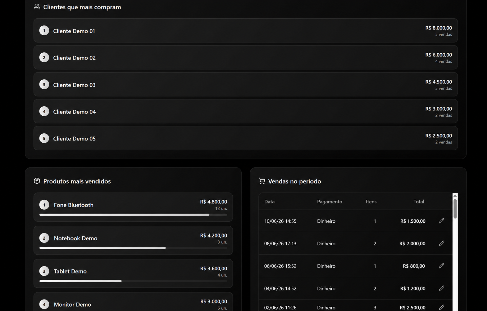
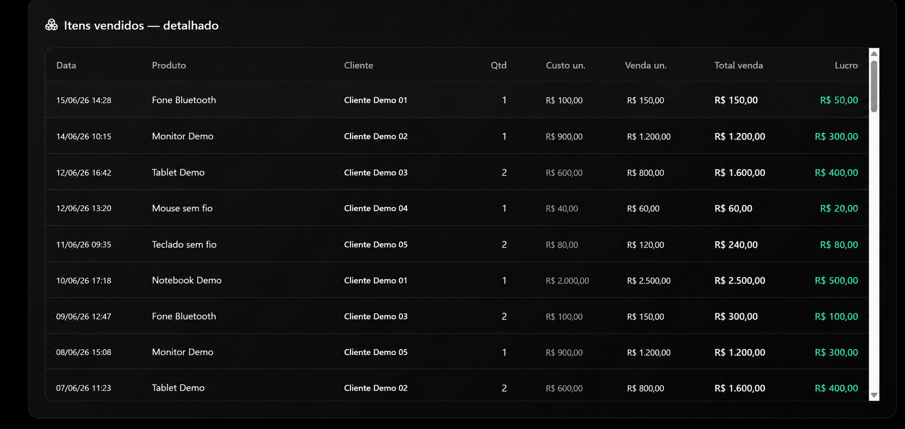

# Gestão comercial

Aplicação web para organizar clientes, produtos, vendas, estoque e relatórios em um único fluxo.

## Versão demonstrativa

Este repositório apresenta a versão de portfólio do projeto. As capturas utilizam dados fictícios, e o ambiente de produção permanece separado.

## Funcionalidades

- Cadastro e consulta de clientes e produtos.
- Controle de estoque na loja e em transporte.
- Registro de vendas com itens, custos e cálculo de lucro.
- Painel de acompanhamento e relatórios.
- Acesso com autenticação e lista de emails autorizados.

## Tecnologias

React, TypeScript, Vite, Tailwind CSS, shadcn/ui e Supabase (PostgreSQL).

## Telas do sistema

> Capturas fornecidas pelo autor e editadas para demonstração. Nomes de clientes, produtos, valores, quantidades, datas e gráficos foram substituídos por dados fictícios. As imagens ilustram a interface e não representam resultados reais do negócio.

### Painel do negócio

Indicadores de faturamento, lucro, vendas, ticket médio e atalhos para as operações.



### Caixa de vendas

Catálogo, disponibilidade de estoque, seleção de cliente e carrinho de venda.



### Formas de pagamento

Seleção de dinheiro, Pix ou cartão e finalização da venda.



### Produtos e estoque

Consulta de produtos, custos e quantidades na loja e em transporte.



### Cadastro de clientes

Formulário com nome, CPF, telefone, email e observações.



### Relatórios e indicadores

Filtros por período e pagamento, indicadores financeiros e gráfico de vendas.



### Rankings e histórico

Clientes e produtos em destaque, com consulta das vendas do período.



### Detalhamento dos itens vendidos

Consulta de cliente, produto, quantidade, custo, preço de venda e lucro por item.



## Executar localmente

Esta versão possui histórico próprio e não está vinculada à sincronização do Lovable. Arquivos de ambiente, identificadores de produção e dados de acesso não foram incluídos; a execução exige a configuração de um ambiente de teste.

Pré-requisitos: Node.js, npm e um projeto Supabase de teste.

```bash
git clone https://github.com/brunoYves22/gestaonathalia-portfolio.git
cd gestaonathalia-portfolio
npm install
cp .env.example .env.local
npm run dev
```

No Windows, copie `.env.example` para `.env.local` pelo Explorador ou com `Copy-Item .env.example .env.local` no PowerShell.

Preencha as variáveis com os valores do **seu projeto Supabase de teste**:

| Variável | Uso |
| --- | --- |
| `VITE_SUPABASE_URL` | URL do projeto Supabase |
| `VITE_SUPABASE_PUBLISHABLE_KEY` | Chave publicável ou anon do projeto de teste |
| `VITE_SUPABASE_PROJECT_ID` | Identificador do projeto de teste |

Aplique as migrações de `supabase/migrations` no seu banco de teste, em ordem cronológica. `supabase/config.toml` usa um identificador local genérico; configure seu próprio projeto se utilizar a CLI.

O banco inclui uma lista de emails autorizados. Depois de aplicar as migrações, cadastre o seu email na tabela `emails_permitidos` pelo SQL Editor do seu próprio Supabase antes de testar o acesso.

Validação do frontend: `npm run build`. O build não configura nem valida o banco de dados.

## Autor

[Bruno Yves Monteiro de Paula](https://www.linkedin.com/in/bruno-yves-monteiro-de-paula-923aa93b4/)
